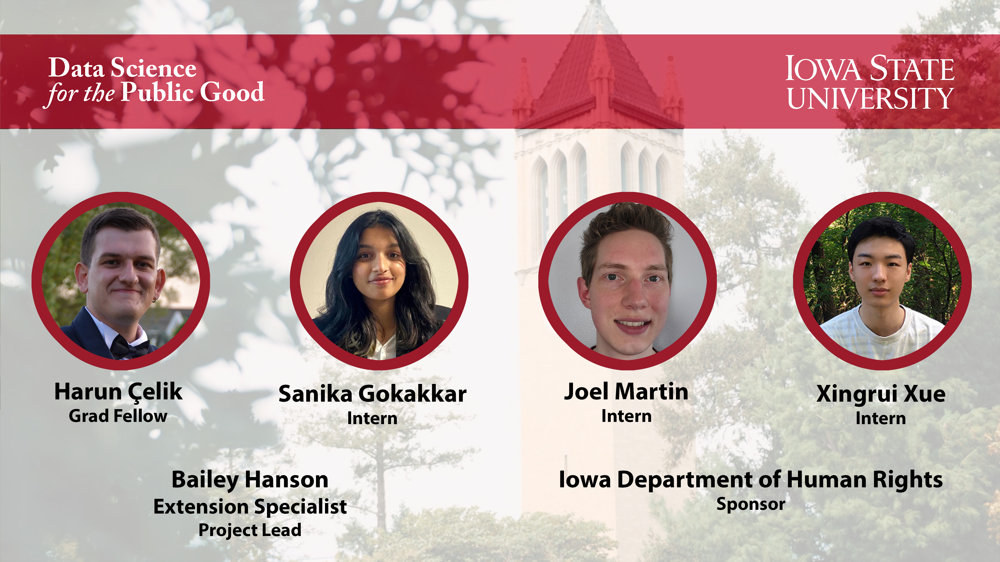

<!-- README.md is generated from README.Rmd. Please edit that file -->

```{r, include = FALSE}
knitr::opts_chunk$set(
  collapse = TRUE,
  comment = "#>",
  fig.path = "man/figures/README-",
  out.width = "100%"
)
```

<!-- badges: start -->
<!-- badges: end -->

## Navigation

Welcome to the Successful Employment for Iowans with Disabilities project page! This is the home for all of the dashboards and documentation that the DSPG 2022 team worked to complete.  


## Team Members


